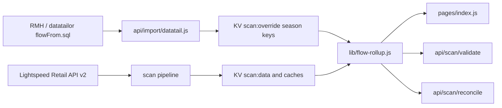
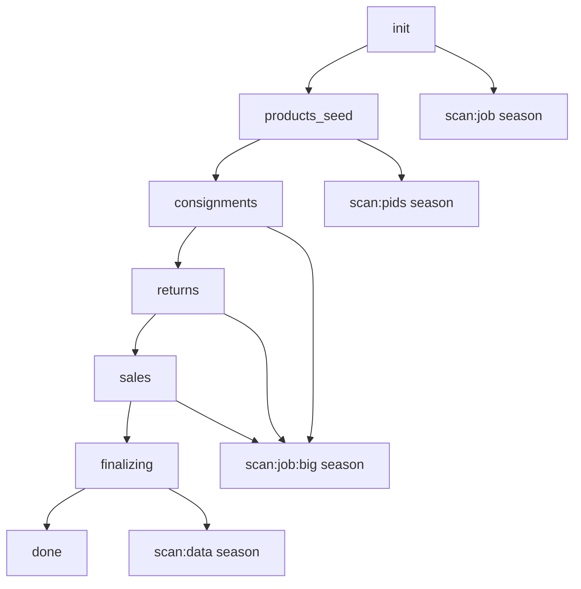
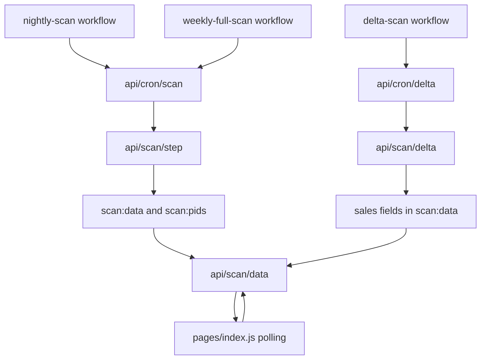
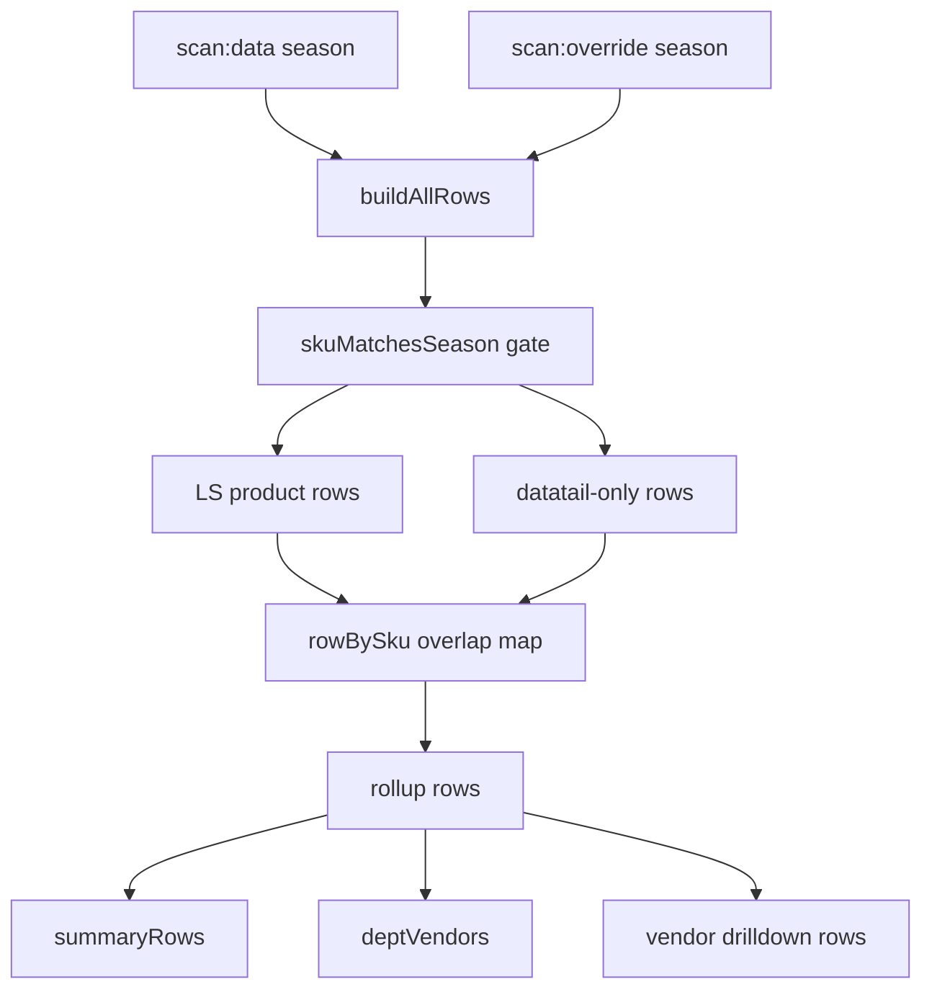
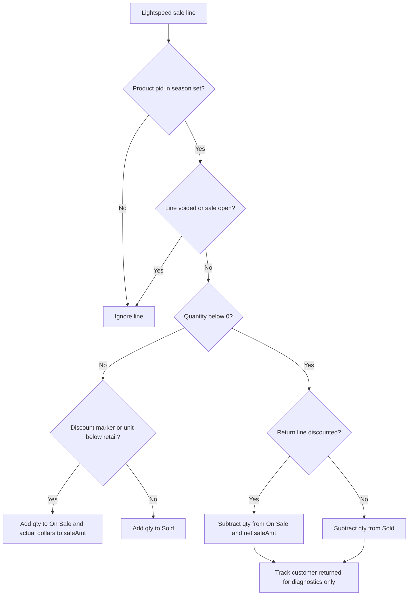

# Flow Report Data Flows

These diagrams map the data paths that matter most for maintaining the report.
`CLAUDE.md` remains the authoritative domain spec; this file is a visual index.

## Old to New Data Lineage

The old RMH/datatailor report is imported as an override, while Lightspeed
provides the live operational data. The request-time rollup is the point where
the two sources are reconciled into one canonical set of rows.

## Scan Pipeline Phases

The full scan advances in small, restartable chunks through `pages/api/scan/step.js`.
Large intermediate and final values use sharded KV helpers so the scan can survive
Vercel and KV request-size limits.

## Sync Mechanisms

The app has separate freshness paths because full LS scans are expensive and
sales need to update during the day. Delta sync is sales-only; it must not mutate
PO, return, or product-discovery behavior.

## Request-Time Rollup Merge

`buildAllRows` creates canonical product rows from LS scan data and datatail
override records. Ordered dollars can include datatail rows that never made it
into LS, but overlapping SKUs stay LS-only to avoid double-counting.

## Sale Classification Decision Tree

The old report split Sold vs SoldSale using `Price = FullPrice`. Lightspeed sale
lines do not always provide the same fields, so `saleContribution` applies the
same intent with discount markers, unit price vs retail price, and return-line
quantity signs.

