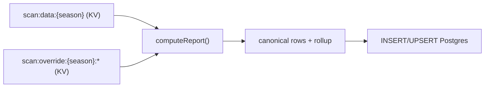

# SQL Migration Plan

Status: IN PROGRESS. The app is being wired for a SQL-backed report path while
keeping the already-verified KV data as the oracle and fallback.

## Why SQL

Vercel KV is a blob/key-value store. It cannot query or aggregate, so the report
endpoint historically had to load a whole multi-MB season blob plus override
records to render a tiny summary. The `scan:report:*` read-cache fixed the
immediate UX problem, but SQL removes the root cause: summary/vendor/product
views become indexed reads instead of whole-season blob reads.

Measured live before the cache: `spring25` was ~16.7s / 10 MB / 7,383 rows, and
even the 122-byte `since` short-circuit took ~15s because the cost was upfront KV
I/O, not transfer.

## Cost

The data footprint is tiny for Postgres: roughly 50-100k product-season rows plus
a few hundred override-vendor rows, well under 100 MB.

- Recommended: Neon Launch via the Vercel Marketplace. Unified Vercel billing,
  pay-as-you-go, no monthly minimum, scale-to-zero, $0.106/CU-hour compute and
  $0.35/GB-month storage. Expected spend: ~$5-15/month for this internal tool.
- Alternative: Supabase Pro via Vercel Marketplace, flat $25/month with a Micro
  instance and 8 GB included storage.
- Moving report reads off KV should shrink the current Upstash KV overage and may
  partially or fully offset the SQL bill.

## Initial Load

The initial SQL load comes from the hardened KV snapshots, not a slow Lightspeed
full sync:

`scripts/backfill-sql-from-kv.js` reads `scan:data:{season}` and
`scan:override:{season}:*`, runs `computeReport()`, and writes SQL rows. No
Lightspeed API calls are needed. If a KV season snapshot has expired, run one
normal scan for that season first.

## Connection Pooling

Use the pooled/serverless endpoint only. Direct per-request `pg` connections can
exhaust small Postgres connection limits in Vercel functions.

- Neon: use `@neondatabase/serverless` (HTTP/WebSocket, no per-Lambda TCP pool) or
  the Neon PgBouncer `-pooler` endpoint.
- Supabase: use Supavisor transaction-mode pooler (port 6543), not direct 5432.
- Keep migrations on a direct/admin connection if needed; app reads/writes use
  the pooled/serverless connection.

## Current Implementation Shape

- `lib/db.js`: Neon serverless client, feature flags, connection detection.
- `lib/sql-report-store.js`: schema creation, SQL upserts, SQL reads. Stores
  canonical product rows in `product_season`, raw override vendors in
  `override_vendor`, and an exact report snapshot in `report_summary` for
  migration parity.
- `scripts/backfill-sql-from-kv.mjs`: initial KV-to-SQL load.
- `pages/api/scan/data.js`: feature-flagged SQL read path with KV fallback.
- `pages/api/scan/step.js` and `pages/api/scan/delta.js`: best-effort dual-write
  to SQL while continuing to write KV.
- `pages/api/import/save.js` and `pages/api/import/datatail.js`: best-effort SQL
  override-vendor dual-write while continuing to write KV.
- `pages/api/scan/verify-sql.js`: compares SQL output to KV-derived
  `computeReport()` output.
- `.github/workflows/verify-sql.yml`: post-deploy/manual parity workflow.

## Cutover Plan

1. Provision Neon via Vercel Marketplace and attach `DATABASE_URL` to production.
2. Run `scripts/backfill-sql-from-kv.mjs` for all active seasons.
3. Enable `REPORT_SQL_WRITE=1` to start dual-write while KV remains the oracle.
4. Enable `REPORT_SQL_READ=1` to serve SQL reads with KV fallback.
5. Run `verify-sql` after deploys and on a schedule through at least one full
   nightly + delta cycle.
6. Only after parity stays green: stop KV dual-write, remove `scan:report:*`,
   retire `lib/kv-sharded.js`/KV scan keys, and reduce KV usage.

## Verification Gate

The SQL cutover is gated by SQL-vs-KV parity. `verify-sql` builds the trusted KV
report via `computeReport(loadScanData, loadOverride, season)` and compares it to
the SQL report at summary, vendor, and product levels. Units must match exactly;
dollars allow a tiny epsilon for numeric rounding. Any mismatch fails the action.

## Risks

- Regressing hard-won RMH/datatail reconciliation. Mitigation: KV remains the
  oracle until `verify-sql` is green across a full nightly + delta cycle.
- Connection exhaustion if a direct connection is accidentally used. Mitigation:
  Neon serverless driver/pooler only.
- SQL provider costs differ slightly in Vercel Marketplace. Confirm the selected
  plan before enabling production writes.
